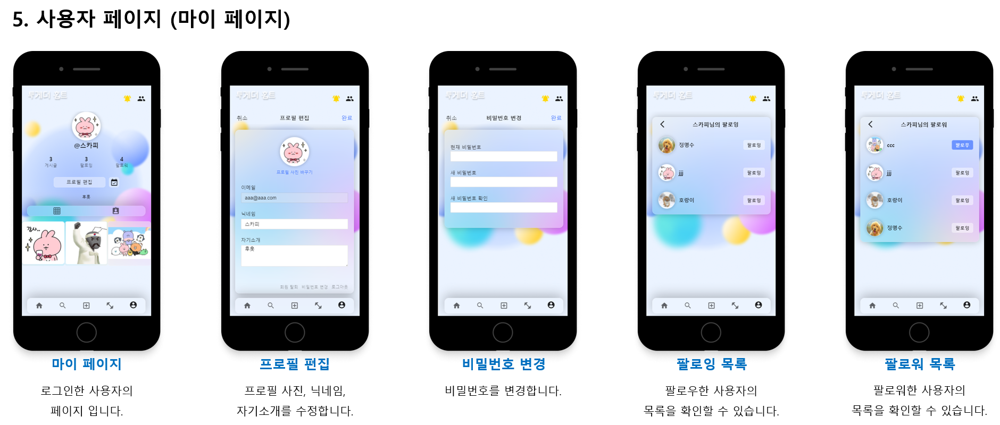
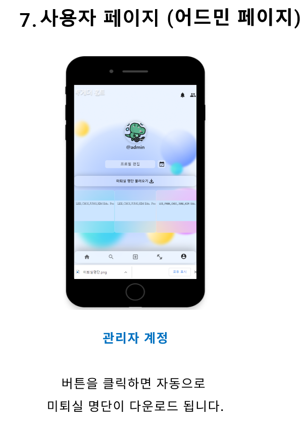
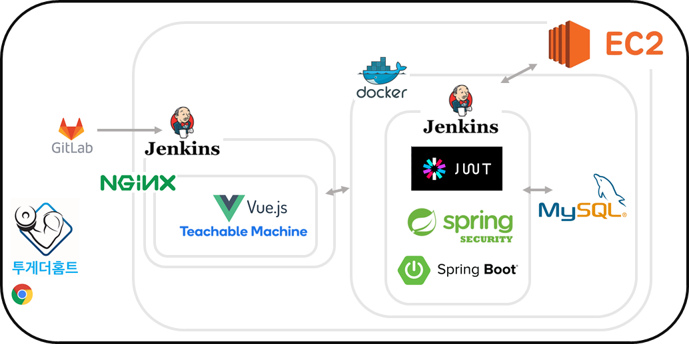

<h1 align="center" style="max-width: 100%;">
  <br/>
  <a href="http://3.38.103.222">www.togetherhomt.com</a>
</h1>

<h3 align="center">
 SSAFY 2학기 공통프로젝트 - 대전 2반 6팀 <남(욱)탓 금지><br/></h3>

<p align="center">
  <b>22.1.5 ~ 22.2.18</b><br /></p>

## ✨ Overview

어깨가 아프고 목이 뻐근하다? 당신은 운동부족 입니다!

당신의 건강을 지켜드립니다.  **운동**하고, **기록**하고, 그리고 모두와 **공유**하세요! 

## 

## ✨ 서비스 화면 및 주요 기능








## 

## ✨ 개발 환경

🖱 **Backend**

- IntelliJ
- spring boot
- spring-boot-jpa
- Spring Security
- Java 8
- AWS EC2
- Maria DB

🖱 **Frontend**

- Visual Studio Code
- Vue.js
- Vuex
- SCSS , CSS

🖱**Pose Detection**

- Teachable Machine

🖱**CI/CD**

- aws ec2
- docker
- nginx
- jenkins

## 

## ✨ 서비스 아키텍처



## 

## 📚 Stack

|                                   |                            |                               |                               |
| --------------------------------- | -------------------------- | ----------------------------- | ----------------------------- |
| :white_check_mark: Desktop Web    | :white_check_mark: Docker  | :white_check_mark: JavaScript | :white_check_mark: Java       |
| :white_check_mark: Mobile Web     | :white_check_mark: Jenkins | :white_check_mark: Vue        | :white_check_mark: Springboot |
| :white_check_mark: Responsive Web | :white_check_mark: Jira    | :white_check_mark: VueX       | :white_check_mark: JPA        |

| Main         | Sub          | Description                                     |
|:------------:|:------------:|:-----------------------------------------------:|
| User         | account      | 회원가입 / 로그인 / 회원정보 수정 / 비밀번호 찾기 / 비밀번호 수정 / 로그아웃 |
| User         | group        | 그룹, 멤버관리 생성, 조회, 삭제                             |
| User         | follow       | 팔로잉, 팔로우 생성, 조회, 삭제                             |
| Feed         | feed         | 피드 조회, 검색 조회, 생성, 수정, 삭제                        |
| Feed         | comment      | 댓글 조회, 생성, 삭제                                   |
| Feed         | like         | 좋아요, 좋아요 취소, 좋아요 유저 목록 조회                       |
| Feed         | tag          | 태그 조회, 생성, 수정                                   |
| Notification | notification | 알림, 메세지, 조회, 생성                                 |
| Exercise     | exercise     | 운동 횟수, 시간, 영상 조회                                |
| Exercise     | record       | 달력표시, attendance 연동                             |
| Exercise     | attendance   | 운동 장바구니 담기, 완료 표시, record연동, 퇴실완료 조회            |

## 

## 📦 ERD


## 

## 🎯 Git

#### Git 컨벤션

```
[ 커밋 타입 ] : [BE/FE] [내용] [#지라이슈넘버]
```

```
FEAT : 기능 추가
FIX : 버그 수정
DOCS : 문서 수정
STYLE : 코드 포맷팅, 세미콜론 누락, 코드 변경이 없는 경우
REFACTOR : 코드 및 컴포넌트구조 리팩토링
TEST : 테스트 코드, 리펙토링 테스트 코드 추가
CHORE : 빌드 업무 수정, 패키지 매니저 수정
```

#### GIT branch 전략

- master
  - hotfix
  - develop
    - feature
      - front / back
        - 각자 맡은 세부기능

## 

## ✏ Jira

일정 및 업무 관리를 위해 Jira를 사용하였습니다.

스프린트를 일주일 단위로 진행하여 매주 월요일에 회의를 통해 각자의 진행상황과 계획을 이야기 하고 진행할 내용들을 스프린트에 등록하였습니다.

- Epic
  
  - 유저, 피드, 검색, 운동, 마이페이지, 어드민
    
    디자인, 리팩토링, 배포, 깃, 발표

- Story
  
  - `[FE / BE]`를 앞에 붙여 알아보기 쉽게 하였고 
    
    Description에 자세한 계획 설명 및 사용기술을 적어놓았습니다

- Subtask
  
  - 실제로 진행할 내용을 작성하였습니다

## 

## ✏ Notion

공지 및 회의기록, 개인 일정이나 진행상황들을 공유하였습니다.

또한 프로젝트 진행에 필요한 자료들과 개인이 공부하면서 도움이된 링크들을 올려두었고 개인이 진행하면서 발생한 에러들을 공유하여 모두가 볼 수 있도록 하였습니다.

## 

## 🐣 팀원 정보 및 업무 분담 내역

| 김남욱                           | 이호열                           | 오수경                           | 임채은                           | 정명수                           | 이건희                           |
| ----------------------------- | ----------------------------- | ----------------------------- | ----------------------------- | ----------------------------- | ----------------------------- |
|  |  |  |  |  |  |
| 팀장, Frontend                  | 서버, Backend                   | UCC, Frontend                 | Notion, Frontend              | JIRA, Backend                 | Gitlab, Backend               |

#### 맡은 역할

- ##### 김남욱
  
  - 뉴스피드(半), 운동 장바구니(半)

- ##### 이호열
  
  - 유저 / 팔로우 / 알림

- ##### 오수경
  
  - 로그인 / 회원가입 / 검색피드 / 운동(모션인식) / 어드민 / 디자인

- ##### 임채은
  
  - 피드 / 피드 등록/ 뉴스피드 / 캘린더 / 사용자 / 부가적인 서비스 페이지

- ##### 정명수
  
  - 파일 업로드 / 운동 기능 / 소셜 로그인

- ##### 이건희
  
  - 피드 / 댓글 / 좋아요 / 태그

## 

## ⚙️ 목표 서비스 구현 및 실제 구현 정도

* 80%
  * 목표 서비스 구현
  * 목표 디자인 구현
  * -20% : Google Teachable Machine을 활용한 학습의 완성도와 코드의 정제화, 속도의 향상이 이루어 지지 않음

## 

## 📔 개인 회고

> Spring Boot과 Java를 처음 접해보는 프로젝트였습니다. Java의 문법에도 익숙하지 않은데 전공자 친구들의 도움으로 많이 배우고 발전한 것을 느꼈습니다. 뿐만 아니라 배포나 깃 관리 같은 부분에서 너무 많은 도움을 받았고, 갈 길이 멀다는 것을 느끼고 동기부여가 되었습니다.앞으로도 꾸준히 공부하고 더 좋은 프로젝트를 만들어보도록 노력하겠습니다.

## ✨ 투게더홈트의 Link!

### 팀 노션

https://www.notion.so/2-6-Home-fd1bb076ef5048c7a5b6c942df5d7b22

### 와이어프레임

https://www.figma.com/file/fSi9NPvyqNqPmjeloZaBYZ/Untitled?node-id=219%3A937

### API

http://3.38.103.222:8092/swagger-ui/index.html
