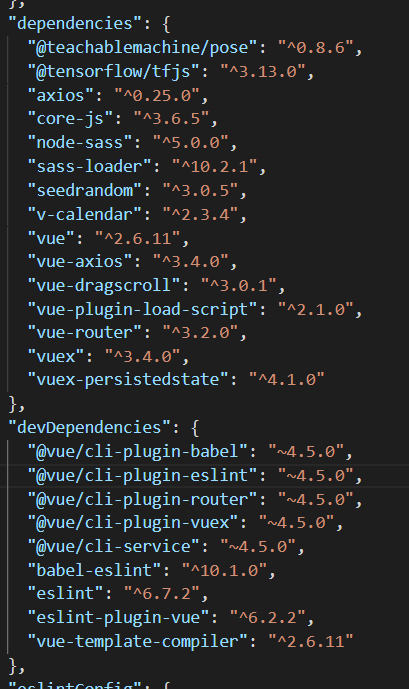
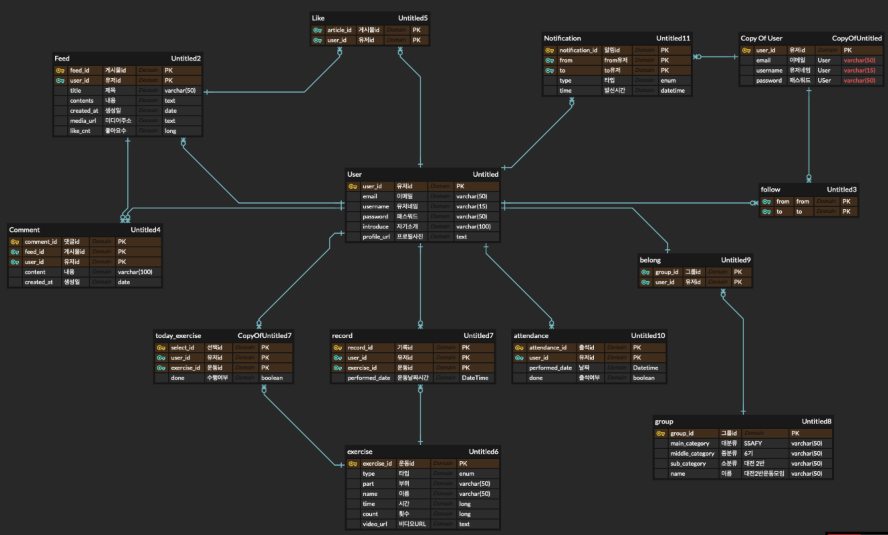

### 1) 사용한 JVM, 웹서버, WAS 제품 등의 종류와 설정값, 버전 기재

> * Java 11 SDK
> * Spring Boot 2.6.2
> * JWT 3.16.0
> * Swagger 3.0
> * MySQL 8.0
> * IntelliJ IDEA Ultimate 2021.3.1

### 2) 빌드 시 사용되는 환경 변수 등의 주요 내용 상세 기재

프로젝트 빌드 시 프로젝트 파일이나 구성 파일에 없는 정보를 사용하여 빌드 옵션을 설치해야하는 경우



### 3) 배포 시 특이사항 기재

배포 시 특이사항 없습니다. 

### 4) DB 접속 정보 등 프로젝트(ERD)에 활용되는 주요 계정 및 프로퍼티가 정의된 파일 목록

- DB 접속정보
  > Docker image - mysql:latest
  
  * Ports
    * 3606
  * Account
    * ID : root
    * PW : together1234!
  * Service Account
    * ID : ssafy
    * PW : 1234
  

- DB 접속 정보 파일 위치 
  /back/together-homt/src/main/resources/application-dep.yml

```java
### Server Configuration
server:
  port: 8092
  servlet:
    context-path: /
    encoding:
      charset: UTF-8
      enabled: true
      force: true


### Logging Configuration
logging:
  level:
    io.swagger.models.parameters.AbstractSerializableParameter: ERROR
# https://github.com/springfox/springfox/issues/2776#issuecomment-600405932
# *** https://blog.karatos.in/a?ID=00950-7a1f5c4c-1e88-40e4-b5bb-5244dc110e2f


### Spring Configuration
spring:
  security:
    oauth2:
      client:
        registration:
          google:
            clientId: 218055408714-o6sjf0a0210j1mphhhk2skqd8fgibg1c.apps.googleusercontent.com
            clientSecret: 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
          naver:
            clientId: hO0yDac2E736Nw_kl6m6
            clientSecret: AffQGYyFfg
            redirectUri: 'http://i6b206.p.ssafy.io:80/main/feed'
            authorizationGrantType: authorization_code
            clientName: naver
        provider:
          naver:
            authorization-uri: https://nid.naver.com/oauth2.0/authorize
            token-uri: https://nid.naver.com/oauth2.0/token
            user-info-uri: https://openapi.naver.com/v1/nid/me
            user-name-attribute: response

  servlet:
    multipart:
      max-file-size: 1000MB
      maxRequestSize: 1000MB
  mvc:
    static-path-pattern: /files/**

  ### Datasource
  datasource:
    driver-class-name: com.mysql.cj.jdbc.Driver
    url: jdbc:mysql://3.38.103.222:3606/together-homt?serverTimezone=Asia/Seoul
    username: ssafy
    password: 1234

  ### JPA
  jpa:
#    show-sql: false

    hibernate:
      ddl-auto: update #create update none
      naming:
        physical-strategy: org.hibernate.boot.model.naming.PhysicalNamingStrategyStandardImpl

#    properties:
#      hibernate:
#        format_sql: true
```

- ERD
  

- 회원 가입 승인 메일 전송 정보
  /back/together-homt/src/main/resources/mailConfirm.properties

```java
mail.smtp.auth=true
mail.smtp.starttls.required=true
mail.smtp.starttls.enable=true
mail.smtp.socketFactory.class=javax.net.ssl.SSLSocketFactory
mail.smtp.socketFactory.fallback=false
mail.smtp.port=465
mail.smtp.socketFactory.port=465

AdminMail.id = togetherhomt@gmail.com
AdminMail.password = together1234!
AdminMail.name = "Together Homt 투게더 홈트"
```
